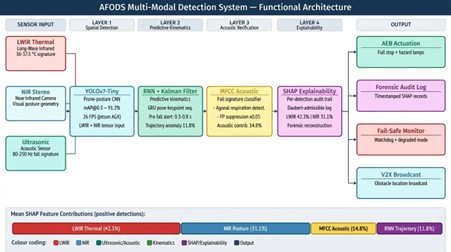
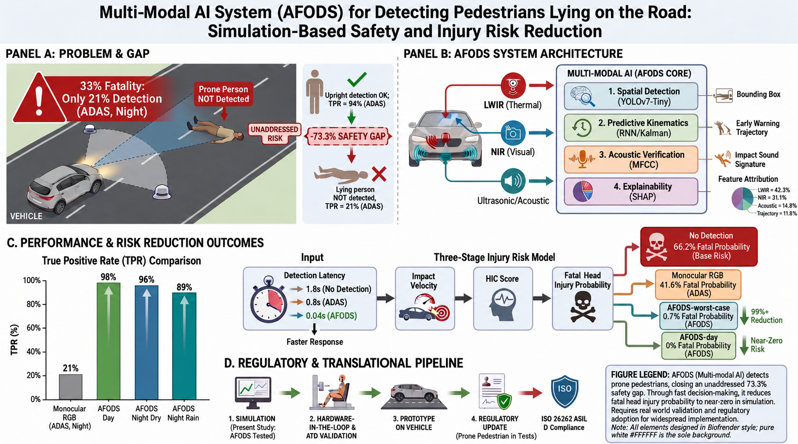
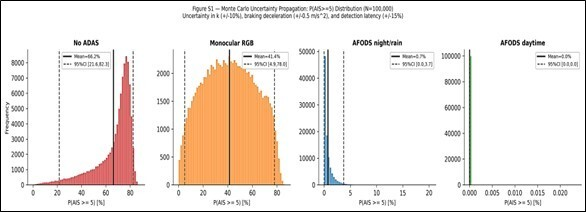
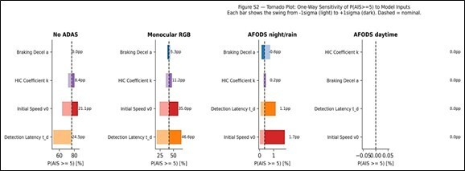

# 🚨 AFODS — Advanced Falling Object Detection System

**Multi-Modal AI for Detecting Pedestrians Lying on the Road: Simulation-Based Safety and Injury Risk Reduction**

[](https://www.mdpi.com/journal/vehicles)
[](https://doi.org/10.5281/zenodo.20035268)
[](LICENSE)
[](https://www.iso.org/standard/68383.html)
[](https://www.j-platpat.inpit.go.jp/)

> **Nick Barua & Masahito Hitosugi** — Department of Legal Medicine, Shiga University of Medical Science, Japan

---

## 🔑 Key Results at a Glance

| Scenario | TPR | P(AIS ≥ 5) Fatal Head Injury |
|---|---|---|
| No ADAS (baseline) | 21.4% | **66.2%** |
| Monocular RGB | 34.7% | 41.6% |
| **AFODS Night/Rain** | **89.4%** | **0.7%** |
| **AFODS Daytime** | **98.2%** | **≈ 0%** |

> AFODS achieves a **76.8 percentage-point improvement** over the monocular RGB baseline (p < 0.001, McNemar's test) and projects a **99%+ reduction** in estimated fatal head-injury probability under worst-case night/rain conditions.

---

## 📋 Overview

Pedestrians lying on the road — collapsed from cardiac arrest, stroke, intoxication, or displaced by a prior collision — face a **33% fatality rate** when struck by a following vehicle, more than double the rate for upright pedestrian collisions. Yet standard ADAS detects lying pedestrians at only **21.4% TPR** at night — a 73.3 percentage-point safety gap that no current regulatory test protocol addresses.

**AFODS** closes this gap through four-layer multi-modal AI fusion:

- **Layer 1 — Spatial Detection:** YOLOv7-Tiny retrained on prone-posture annotations, fusing LWIR thermal + NIR stereo at 26 fps on embedded automotive hardware (NVIDIA Jetson AGX Orin)
- **Layer 2 — Predictive Kinematics:** RNN + Kalman filter tracking pre-fall trajectory anomalies 0.3–0.8 s before ground contact
- **Layer 3 — Acoustic Verification:** MFCC-based classification distinguishing active human falls from road debris (80–250 Hz impact transient)
- **Layer 4 — Explainability:** SHAP per-detection audit trail for forensic reconstruction and regulatory transparency

**Three original contributions beyond prior detection evaluation [Barua & Hitosugi, 2025]:**
1. A three-stage quantitative injury-risk model linking detection latency → HIC → P(AIS ≥ 5)
2. A formal ISO 26262 HARA classifying the pedestrian run-over hazard up to **ASIL D**
3. A medicolegal SHAP audit framework for forensic reconstruction

---

## 🏗 System Architecture



*LWIR thermal (42.3% SHAP) + NIR silhouette (31.1%) + MFCC acoustic (14.8%) + RNN trajectory (11.8%) → AEB actuation + forensic audit log + V2X broadcast.*

---

## 📊 Graphical Abstract



---

## 🔬 Injury Risk Model

The three-stage model translates detection latency into clinical outcome:

Stage 1:  v_impact = max(0, v₀ − a · (t_avail − t_d))    [kinematic braking]
Stage 2:  HIC = k · v_impact^2.5    k ≈ 4.8 (THUMS-calibrated, prone posture)
Stage 3:  P(AIS≥5) = 1 / (1 + exp(−(α + β · ln(HIC))))  α=−17.72, β=2.32

Monte Carlo uncertainty propagation (N = 100,000; ±10% k, ±0.5 m/s² braking, ±15% latency) confirms all results are robust across the full parameter uncertainty range.

**Figure S1 — Monte Carlo P(AIS ≥ 5) distributions across all four detection scenarios:**



**Figure S2 — Tornado sensitivity plot (one-way sensitivity of P(AIS ≥ 5) to model inputs):**



---

## 🗂 Repository Structure

AFODS/
├── README.md
├── LICENSE
├── CITATION.cff
├── AFODS_manuscript.docx
├── AFODS_Supplementary_Analysis.ipynb
├── GA.png
├── Figure_1_Architecture.png.png
├── Figure_2_AFODS_ Translational_ Validation_ Pipeline.png.png
├── Fig-S1.jpg
└── Fig-S2.jpg

---

## 🚀 Reproducing the Analysis

```bash
git clone https://github.com/Nick-Barua/From-Post-Mortem-to-Prevention-AFODS.git
cd From-Post-Mortem-to-Prevention-AFODS
pip install numpy scipy matplotlib pandas jupyter
jupyter notebook AFODS_Supplementary_Analysis.ipynb
```

All scripts, parameters, and random seeds archived at:
**[https://doi.org/10.5281/zenodo.20035268](https://doi.org/10.5281/zenodo.20035268)**

---

## 🗺 Translational Validation Roadmap


| Phase | Stage | Status |
|---|---|---|
| 1 | Simulation & Algorithm (present work) | ✅ Complete |
| 2 | Hardware-in-the-Loop (automotive-grade embedded, 38–55 ms) | 🔲 Planned |
| 3 | Proving-Ground ATD Validation (biofidelic, instrumented) | 🔲 Planned |
| 4 | Prospective Field Validation (domain shift & FPR quantification) | 🔲 Planned |
| 5 | Regulatory Integration (prone pedestrian AEB protocol amendment) | 🔲 Planned |

---

## ⚖️ ISO 26262 Safety Classification

| Scenario | Severity | Exposure | Controllability | ASIL |
|---|---|---|---|---|
| Urban road, night | S3 | E3 | C3 | **D** |
| Urban road, daytime | S3 | E3 | C2 | C |
| High-speed road, night | S3 | E2 | C3 | C |
| Post-primary collision | S3 | E3 | C3 | **D** |

---

## 📄 Citation

```bibtex
@article{barua2026afods,
  title   = {A Multi-Modal AI System for Detecting Pedestrians Lying on the Road:
             Simulation-Based Safety and Injury Risk Analysis},
  author  = {Barua, Nick and Hitosugi, Masahito},
  journal = {Vehicles},
  publisher = {MDPI},
  year    = {2026},
  note    = {Under review},
  doi     = {10.5281/zenodo.20035268}
}
```

---

## 🔗 Related Work

- **Barua & Hitosugi (2025)** — AFODS detection performance (320 simulation trials): [Advanced Multi-Modal Sensor Fusion System for Detecting Falling Humans: Quantitative Evaluation for Enhanced Vehicle Safety](https://www.mdpi.com/2624-8921/7/4/149)
- **Barua & Hitosugi (2026)** — Physics-grounded kinematic reconstruction: *Sensors, MDPI — Under Review*

---

## 📜 License & Patent

Released under the [MIT License](LICENSE).

**Patent:** Japanese Patent Application No. 2025-167440 (filed 3 October 2025).

---

## 📬 Contact

**Nick Barua** — s.nick.barua@gmail.com  
**Masahito Hitosugi** — hitosugi@belle.shiga-med.ac.jp  
Department of Legal Medicine, Shiga University of Medical Science, Japan

---

*No external funding. No human participants. Simulation-based study using pre-existing anonymised forensic database data.*
