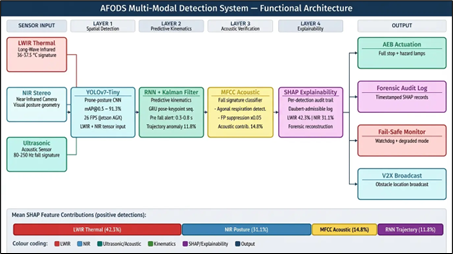
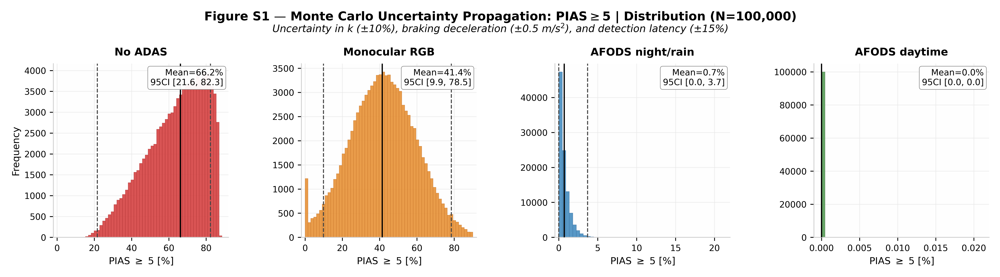
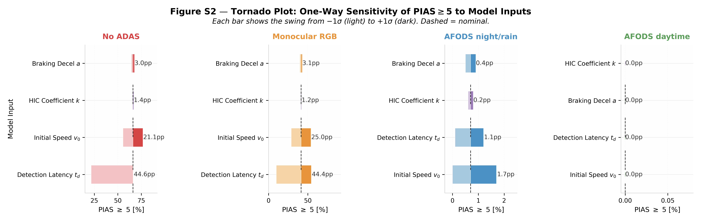
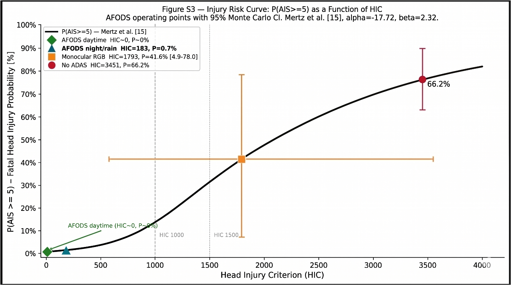
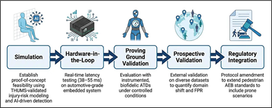

# From Post-Mortem to Prevention: A Multi-Modal AI System for Detecting Pedestrians Lying on the Road

[](https://doi.org/10.5281/zenodo.20116244)
[](https://opensource.org/licenses/Apache-2.0)
[](https://www.iso.org/standard/68383.html)
[](https://www.j-platpat.inpit.go.jp/)

**Nick Barua & Masahito Hitosugi**
Department of Legal Medicine, Shiga University of Medical Science, Otsu, Shiga, Japan

> **Barua, N., & Hitosugi, M. (2026).** *A Multi-Modal AI System for Detecting Pedestrians Lying on the Road: Simulation-Based Safety and Injury Risk Analysis.* Vehicles (Under Review). Archival DOI: 10.5281/zenodo.20116244

---

## Graphical Abstract


---

## Overview

Pedestrians lying on the road — collapsed from cardiac arrest, stroke, intoxication, or displaced by a prior collision — face a **fatality rate of 33.0%** when struck by a following vehicle, more than double the rate for upright pedestrian collisions. Yet standard ADAS detects lying pedestrians at only **21.4% TPR** under night conditions — a **73.3 percentage-point** classification gap that no current regulatory test protocol addresses.

The **Advanced Falling Object Detection System (AFODS)** closes this gap through four-layer multi-modal sensor fusion, achieving 95.6–98.2% TPR across environmental conditions in simulation.(AFODS = Advanced Falling Object Detection System; "falling object" denotes the low-profile human form at road level — see Terminological Conventions below)
This repository is the companion archive for the three original contributions of the 2026 paper:

1. A three-stage quantitative injury-risk model translating detection latency into Head Injury Criterion (HIC) and estimated fatal injury probability P(AIS ≥ 5) — all outputs are exploratory estimates pending real-world ATD validation
2. A formal ISO 26262 Hazard Analysis and Risk Assessment (HARA) classifying the pedestrian run-over hazard up to **ASIL D**, determined via the deterministic S3 + E4 + C3 lookup under ISO 26262-3:2018 Annex B Table B.1
3. A medicolegal SHAP interpretability framework for post-incident forensic reconstruction — constituting a potential future contribution to evidentiary frameworks, not a presently demonstrated legal instrument

---

## Key Results

### Detection Performance

| Condition | TPR (%) [95% CI] | FPR (%) [95% CI] | Latency (ms) |
|-----------|-----------------|-----------------|-------------|
| Daytime, clear | **98.2** [97.4–98.8] | 1.8 [1.2–2.5] | 38 |
| Night, dry road | **95.6** [94.3–96.7] | 3.1 [2.3–4.1] | 42 |
| Night, rain | **89.4** [87.2–91.3] | 5.2 [4.0–6.6] | 51 |
| Night, fog | **84.7** [82.1–87.0] | 6.8 [5.3–8.5] | 55 |

AUC (overall): **0.981** [95% CI: 0.976–0.985]. Improvement over monocular RGB baseline: **+76.8 pp** (*p* < 0.001, McNemar's test with continuity correction).

**Subgroup note:** For the primary clinical scenario (pedestrians already lying on the road prior to vehicle arrival), the acoustic layer (Layer 3) contributes negligibly — detection relies on LWIR thermal + NIR silhouette geometry alone. The effective TPR for this subpopulation corresponds directly to the **LWIR + NIR ablation row: 91.6%**. The aggregate 98.2% figure includes active-fall events that benefit from additional acoustic cues.

### Injury-Risk Model — Monte Carlo Analysis (*N* = 100,000)

| Scenario | Detection Latency | v_impact (km/h) | P(AIS ≥ 5) MC Mean [95% CI] |
|----------|------------------|-----------------|------------------------------|
| No ADAS | — | 50.0 | **66.2%** [21.6–82.3%] |
| Monocular RGB baseline | 1.6 s | 38.5 | **41.6%** [4.9–78.0%] |
| AFODS — worst case (night/rain) | 0.8 s | 15.4 | **0.7%** [0.0–3.7%] |
| AFODS — daytime | 0.04 s | 0.0 | **≈ 0%** |

*HIC = k · v²·⁵ (k ≈ 4.8, THUMS-calibrated, prone/supine posture). P(AIS ≥ 5) per Mertz et al. [1997] logistic model (α = −17.72, β = 2.32). All estimates are simulation-derived exploratory projections; prospective real-world ATD validation required.*

---

## System Architecture



*LWIR thermal (SHAP: 42.3%) + NIR silhouette (31.1%) + MFCC acoustic (14.8%) + RNN trajectory (11.8%) → AEB actuation + forensic audit log + V2X broadcast.*

**Four processing layers:**

- **Layer 1 — Spatial Detection:** YOLOv7-Tiny retrained on prone-posture annotations; fuses LWIR thermal + NIR stereo input tensors at 26 fps on NVIDIA Jetson AGX Orin (mAP@0.5: 91.3%)
- **Layer 2 — Predictive Kinematics:** RNN + Kalman filter tracking trajectory anomalies; generates pre-impact alerts 0.3–0.8 s before ground contact
- **Layer 3 — Acoustic Verification:** MFCC-based classification of active human falls (80–250 Hz impact transient) versus road debris; contributes negligibly for pedestrians already lying on the road prior to vehicle arrival
- **Layer 4 — Explainability:** SHAP per-detection feature attribution audit trail supporting post-incident forensic reconstruction; potential future contribution to medicolegal evidentiary frameworks pending independent legal assessment

---

## Injury-Risk Model

The three-stage model translates detection latency directly into estimated clinical outcome:

**Stage 1 — Kinematics:**

$$
v_{\text{impact}} =
\begin{cases}
\max\!\left(0,\; v_0 - a \cdot (t_{\text{avail}} - t_d)\right) & \text{if } t_d < t_{\text{avail}} \\
v_0 & \text{if } t_d \geq t_{\text{avail}}
\end{cases}
$$

**Stage 2 — Biomechanics (THUMS-calibrated, prone posture):**

$$
\text{HIC} = k \cdot v_{\text{impact}}^{2.5}, \quad k \approx 4.8
$$

**Stage 3 — Clinical Risk (Mertz et al., 1997):**

$$
P(\text{AIS} \geq 5) = \frac{1}{1 + \exp\!\left(-(\alpha + \beta \cdot \ln \text{HIC})\right)}, \quad \alpha = -17.72,\ \beta = 2.32
$$

Monte Carlo uncertainty propagation (N = 100,000; ±10% k, ±0.5 m/s² braking deceleration, ±15% latency) confirms all results are robust across the full modelled parameter range. The transferability of the logistic parameters to the prone run-over contact geometry is a modelling assumption requiring prospective ATD validation.

---

## Supplementary Figures

**Figure S1 — Monte Carlo P(AIS ≥ 5) distributions across all four detection scenarios:**



**Figure S2 — Tornado plot: one-way sensitivity of P(AIS ≥ 5) to primary model inputs:**



**Figure S3 — Injury risk curve: continuous P(AIS ≥ 5) as a function of HIC with AFODS operating points overlaid:**



---

## Translational Validation Roadmap



| Phase | Stage | Status |
|-------|-------|--------|
| 1 | Simulation & algorithm development (present work) | ✅ Complete |
| 2 | Hardware-in-the-loop (automotive-grade embedded, 38–55 ms) | 🔲 Planned |
| 3 | Proving-ground ATD validation (biofidelic, instrumented) | 🔲 Planned |
| 4 | Prospective field validation (domain shift & FPR quantification) | 🔲 Planned |
| 5 | Regulatory integration (prone pedestrian AEB protocol amendment) | 🔲 Planned |

---

## ISO 26262 HARA Summary

| Scenario | S | E | C | ASIL |
|----------|---|---|---|------|
| Urban road, pedestrian lying on road, daytime | S3 | E3 | C2 | **C** |
| Urban road, pedestrian lying on road, night | S3 | E4 | C3 | **D** |
| High-speed road, pedestrian lying on road, night | S3 | E2 | C3 | **C** |
| Post-primary collision, multi-vehicle | S3 | E4 | C3 | **D** |

*S = Severity; E = Exposure; C = Controllability. Determined per ISO 26262-3:2018, Annex B Table B.1. The combination S3 + E4 + C3 uniquely and deterministically yields ASIL D. C2 = normally controllable; C3 = difficult or uncontrollable. E2 = low to medium probability (<1% of operating time); E3 = medium to high probability; E4 = high probability (>10% of operating time).*

---

## Terminological Conventions

| Term | Domain | Meaning in this study |
|------|--------|----------------------|
| Pedestrians lying on the road | Clinical / epidemiological | Primary operational scenario: individuals already at road level when struck |
| Non-upright | ADAS / machine vision | Target classification category: postures outside current pedestrian test standards |
| Prone / supine | Biomechanics | Specific physical configuration of the target body modelled in THUMS simulations |
| Falling object | Engineering (AFODS acronym only) | Low-profile human form at road level, distinguishing the detection target from upright pedestrians |

---

## Repository Contents

| File | Description |
|------|-------------|
| `AFODS_Supplementary_Analysis.ipynb` | Reproducible Python notebook: Equations 1–3, Monte Carlo propagation (*N* = 100,000), and all plot-generation scripts |
| `Figure_1.png` | AFODS Multi-Modal Functional Architecture with SHAP feature attribution panel |
| `Figure_2.png` | AFODS Translational Validation Pipeline |
| `Figure_S1.png` | Monte Carlo uncertainty propagation — P(AIS ≥ 5) distributions |
| `Figure_S2.png` | Tornado plot — one-way sensitivity of P(AIS ≥ 5) to model inputs |
| `Figure_S3.png` | Injury risk curve — continuous P(AIS ≥ 5) as a function of HIC |
| `GA.png` | Graphical abstract |
| `CITATION.cff` | Machine-readable citation metadata |
| `LICENSE` | Apache-2.0 |

---

## Reproducing the Analysis

```bash
git clone https://github.com/Nick-Barua/From-Post-Mortem-to-Prevention-AFODS.git
cd From-Post-Mortem-to-Prevention-AFODS
pip install numpy scipy matplotlib pandas seaborn jupyter
jupyter notebook AFODS_Supplementary_Analysis.ipynb
```

All scripts, parameters, and random seeds are archived at: https://doi.org/10.5281/zenodo.20116244

---

## Citation

### Primary 2026 Study *(Under Review)*

```bibtex
@misc{barua2026afods,
  title  = {A Multi-Modal AI System for Detecting Pedestrians Lying on the Road:
            Simulation-Based Safety and Injury Risk Analysis},
  author = {Barua, Nick and Hitosugi, Masahito},
  year   = {2026},
  note   = {Under Review at Vehicles (MDPI)},
  doi    = {10.5281/zenodo.20116244}
}
```

### Baseline 2025 Study

```bibtex
@article{barua2025afods,
  title     = {Advanced Multi-Modal Sensor Fusion System for Detecting Falling Humans:
               Quantitative Evaluation for Enhanced Vehicle Safety},
  author    = {Barua, Nick and Hitosugi, Masahito},
  journal   = {Vehicles},
  volume    = {7},
  number    = {4},
  pages     = {149},
  year      = {2025},
  publisher = {MDPI},
  doi       = {10.3390/vehicles7040149}
}
```

Or use the `CITATION.cff` file for automatic citation export via GitHub.

---

## License & Patent

Released under the Apache-2.0 License.

Patent: Japanese Patent Application No. 2025-167440 (filed 3 October 2025). N.B. declares this filed patent on the AFODS technology described in this paper.

---

## Contact

**Nick Barua** — s.nick.barua@gmail.com
**Masahito Hitosugi** — hitosugi@belle.shiga-med.ac.jp
Department of Legal Medicine, Shiga University of Medical Science, Japan

---

*No external funding. No human participants. Simulation-based study using pre-existing anonymised forensic database data (Hitosugi et al., 2021). All performance figures are simulation-derived; prototype validation on real-world hardware is required before deployment claims can be made.*
